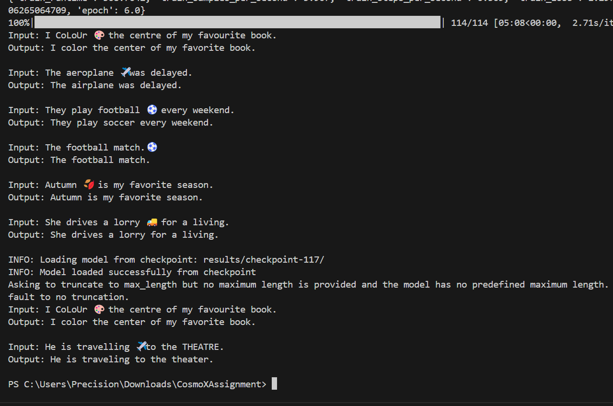

# **READ ME**

## **Instructions to Run the code**

1. **Install dependencies**
   ```bash
   !pip install torch==2.5.1 torchvision==0.20.1 cpuonly -c pytorch
   !pip install transformers[torch]
   !pip install tokenizers
   !pip install pandas
   !pip install emoji
   !pip install sentencepiece
   !pip install nltk

2. **Instructions to run on VSCODE**  
   ```bash
   pip install -r requirements.txt

3. **Data**
   Make sure dataset file (.xlsx) is available. It is a very small dataset.

# Understanding the data - Visual inspection

* A very tiny dataset.
* Visually inspecting the data we see there is noise (emojis). Its deemed noise as it is not in target column. If emojis appeared in target column, we would have to devise a mechanism to retain them.
* No missing values, but there are duplicates which we shall remove.
* Case handling. This can be tricky. Should we consider leaving casing as it is or normalize it? Normalizing non-proper nouns would be ok.
* First letter of first word in targe column is capitalized. This property of data should be retained during preprocessing

# Model Selection and Justification

* We have a text to text conversion/transformation task.
* A sequence-to-sequence model is appropriate in this case.
* Transformers, especially pre-trained models like T5, are good for such tasks.
* T5 is designed for text-to-text tasks, so fine-tuning T5-small or T5-base on this dataset could work.
* It requires minimal hyperparameter tuning for dialect conversion.
* Using a smaller model like a Seq2Seq model with attention, but given the small dataset, a pre-trained model would likely perform better.
* The justification for T5 is that it is designed for various text generation tasks, can handle the text-to-text format, and benefits from transfer learning, which is crucial with limited data to avoid overfitting

# Design of the Code
* Design a pipline
* Supporting data loading, preprocessing, splitting, training and inference


# **Training and Inference**

1. Initiliaze the pipeline (main.py if you are in VSCODE)
2. Setup sequence to sequence training arguments
3. Provide input file
4. Run the pipeline
5. Do the inference

    ```bash
    from pipline import DialectTranslationPipeline
    from transformers import Seq2SeqTrainingArguments


    pipeline = DialectTranslationPipeline()

    # Define training arguments
    training_args = Seq2SeqTrainingArguments(
        output_dir="./results",
        num_train_epochs=6,
        per_device_train_batch_size=16,
        per_device_eval_batch_size=16,
        evaluation_strategy="epoch",
        logging_steps=10,
        save_total_limit=4,
        weight_decay=0.01,  # L2 regularization
    )


    # Run full pipeline
    trainer = pipeline.run("Dataset.xlsx", training_args)

    # Evaluate custom input
    input_texts = [
        "I CoLoUr 🎨 the centre of my favourite book.",
        "The aeroplane ✈️ was delayed.",
        "They play football ⚽ every weekend.",
        "The football match.⚽ ",
        "Autumn 🍂 is my favorite season.",
        "She drives a lorry 🚚 for a living."

    ]
    predictions = pipeline.predict([pipeline.preprocess_text(text) for text in input_texts])
    for text, pred in zip(input_texts, predictions):
    print(f"Input: {text}\nOutput: {pred}\n")


    # Initialize pipeline for inference (loading from checkpoint)
    inference_pipeline = DialectTranslationPipeline(
        model_name="t5-base",
        checkpoint_dir="results/checkpoint-117/"
    )

    # Generate predictions
    input_texts = [
        "I CoLoUr 🎨 the centre of my favourite book.",
        "He is travelling ✈️ to the THEATRE.",
    ]
    predictions = inference_pipeline.predict([pipeline.preprocess_text(text) for text in input_texts])

    for input_text, pred in zip(input_texts, predictions):
        print(f"Input: {input_text}\nOutput: {pred}\n")


# Output from the code




# Most Important Step
## Not allow the model to over fit by augumenting the data
This critical step helped on stopping the model from over-fitting.
Despite that due to lack of data, unseen words would be missed, such as lorry. A small synthetic data was also created to test the code,